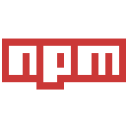

<!--  -->

<h1 align="center">Hi, I'm Lakshit Somani</h1>  
<h3 align="center">A Software Engineer & Visual Storyteller</h3>  
  
  
  
    

  

---

<!-- 

 -->

I’m a self-taught developer with a knack for creative design and a solid grasp of various programming languages and tools. I’m known for my reliability, effective time management, and a flair for collaboration, making me a valuable asset to any tech team.

<!--
## 📔: About Me

- 🖥 &nbsp; Software Developer with bold ideas
- 🔭 &nbsp; Currently working on some side projects in Python and Typescript
- 🌱 &nbsp; Following **MERN Stack**.
- 💬 &nbsp; Do Competitive Coding using C++
- ✊ &nbsp; Create themes extensions for VS Code [Marketplace](https://marketplace.visualstudio.com/publishers/lakshits11/)
<!-- - 🌐 &nbsp; Also learning Machine Learning, Data science -->

## 🔭 About Me

* 💻 I specialize in designing scalable, high-performance applications, leveraging my expertise in the MERN stack, Python, and C++ to deliver robust, production-ready solutions.

* 🚀 Adept at architecting full-stack systems, I excel at crafting seamless integrations between frontend frameworks, API layers, and database management systems like PostgreSQL and MongoDB.

* 🌐 I’m passionate about building intelligent, data-driven applications, exploring machine learning models to enhance functionality and user experience.

<!-- * 🔧 Currently, I’m developing a state-of-the-art real estate platform, focusing on complex data pipelines, dynamic search algorithms, and scalable backend infrastructures. -->

## 🚀 Languages & Frameworks

## 🛠️ Tools

<!-- 

 

 -->

<!-- 

-->

<!-- ## 🙌 Platforms

## ✌ Other Development Tools

<!--  -->
<!--  -->
<!--  -->
<!--  -->
<!--  -->
<!-- &nbsp; -->
<!--  -->
<!--  -->
<!--  -->
<!--  -->
<!-- 
 -->

## 🏆 Github Stats

  
<!--    
   
    -->
    

## Metrics

